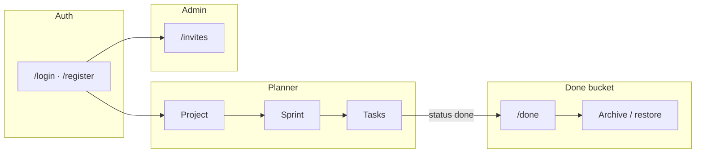
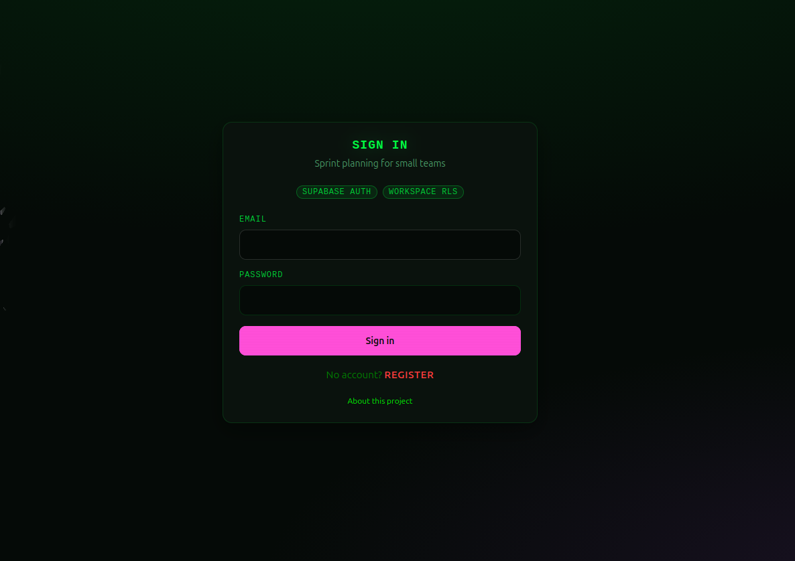
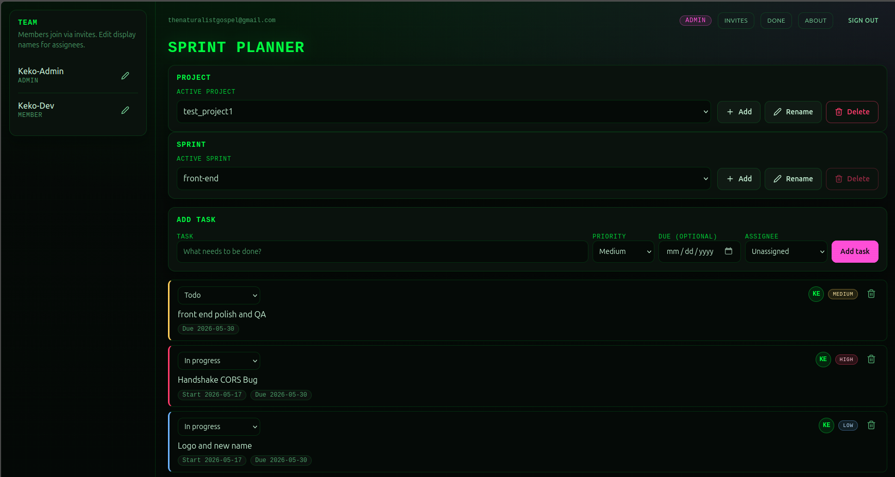
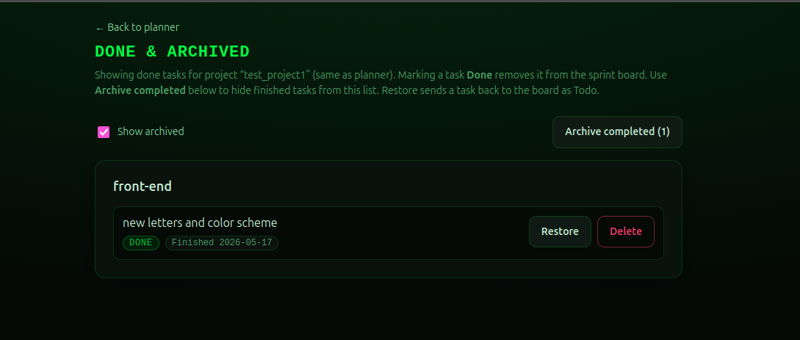
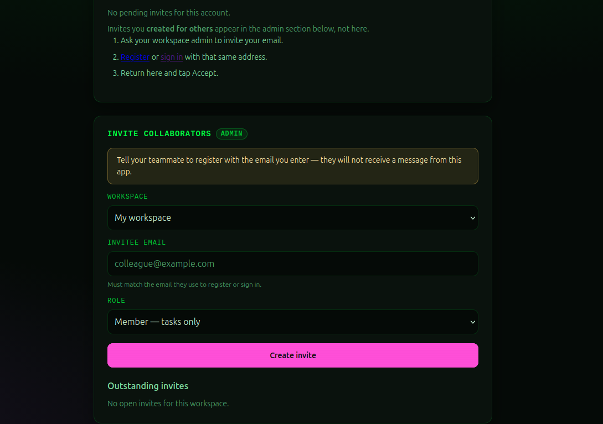
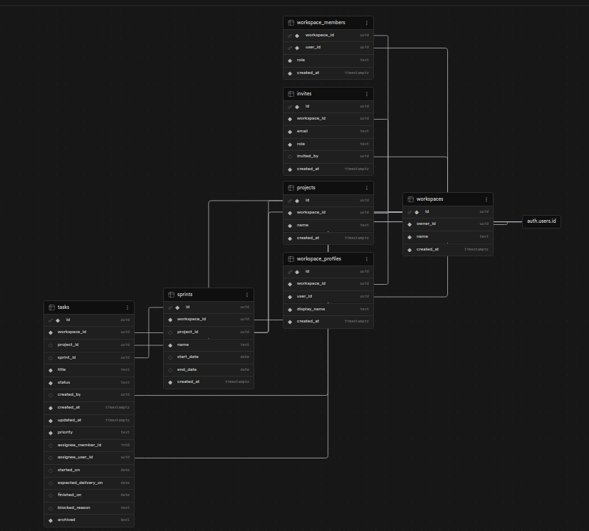

# Sprint Planner

Web-based sprint planning and tasks for small teams. **V2 is shipped** on **Create React App** + **Supabase Auth / Postgres / RLS** + **Vercel**.

**Live demo:** https://matrix-themed-sprint-planner.vercel.app

**For reviewers:** jump to [App walkthrough (screenshots)](#app-walkthrough-production) and [Data model](#data-model-supabase) below.

## Documentation map (start here)

| Doc | Purpose |
|-----|--------|
| **[docs/v2.md](./docs/v2.md)** | V2 spec (phases 0–5 **Done**): entities, permission matrix, flows |
| **[docs/v2.1.md](./docs/v2.1.md)** | V2.1: vaporwave polish + team in Supabase — [QA checklist](./docs/v2.1-qa.md) |
| **[docs/v2.2.md](./docs/v2.2.md)** | V2.2 polish sprint — [QA checklist](./docs/v2.2-qa.md) · [Ship guide (outside Cursor)](./docs/v2.2-ship-guide.md) |
| **[docs/scope.md](./docs/scope.md)** | Product hierarchy: Workspace → Project → Sprint → Task |
| **[docs/rls.md](./docs/rls.md)** | RLS policy model, RPC patterns, testing checklist |
| **[AGENTS.md](./AGENTS.md)** | Agent rules, handoff habits, **Cursor bootstrap prompt** |

**Agents and contributors:** read [docs/v2.md](./docs/v2.md) first, then update its **Progress tracker** when you ship work.

---

## Current app (`main`)

| Area | Status |
|------|--------|
| **Stack** | React 18, TypeScript, **CRA** (`react-scripts`), Framer Motion, Lucide, **React Router**, `@supabase/supabase-js` |
| **Auth** | `/login`, `/register`; protected `/`; session persists on refresh; **`ensure_workspace_for_user`** RPC |
| **Workspace** | Auto-created on first sign-in; rows in `workspaces` + `workspace_members` |
| **Invites** | `/invites` — admin invite/revoke; invitee signs in with **invited email** and **Accept** (no invite email sent by the app) |
| **Planner** | **Sprints + tasks** → Supabase; **team roster** → `workspace_profiles` (shared display names, `assignee_user_id`) |
| **Projects** | Admin-managed projects; planner filters sprints/tasks by active project — [docs/scope.md](./docs/scope.md) |
| **Permissions** | Role badge; members CRUD tasks; admins manage projects/sprints/invites; RLS via `supabaseErrors.ts` |
| **About** | `/about` — stack, links, product hierarchy ([AboutPage](./src/pages/AboutPage.tsx)) |
| **Deploy** | **Live** on Vercel — [Deployment (Vercel)](#deployment-vercel) |
| **V2.2** | Projects UI, task tracker, About, matrix theme, polish — [docs/v2.2.md](./docs/v2.2.md) |
| **Post-V2 optional** | Next.js migration; invite email — [docs/v2.md § Optional follow-ups](./docs/v2.md#optional-follow-ups-not-v2) |

---

## Features (today)

- **Project** CRUD and switcher (admins); sprints scoped to active project
- Sprint CRUD and switcher (stored in **Supabase**)
- Tasks with status (todo / in progress / blocked / done), dates, priority, assignee (`assignee_user_id`)
- **Done** view at `/done` (completed & archived tasks, restore or delete)
- Team sidebar from **Supabase** (`workspace_profiles`)
- Stats strip; matrix-green text hierarchy + magenta accents (V2.2 PR4)
- Multi-user workspace + email invites
- **About** page at `/about`

---

## Local setup

```bash
git clone https://github.com/KekoFigueroa-dev/matrix-themed-sprint-planner.git
cd matrix-themed-sprint-planner
npm install
cp .env.example .env.local   # then fill in Supabase URL + key
npm start
```

- Dev server: [http://localhost:3000](http://localhost:3000) — use **one origin** consistently (`localhost` vs `127.0.0.1` have separate storage).
- Production bundle: `npm run build` → `build/`

On Windows PowerShell, if execution policy blocks scripts:

```powershell
Set-ExecutionPolicy -Scope Process -ExecutionPolicy Bypass
```

**Repository hygiene:** `node_modules/` is **gitignored** and must not be committed (historical commits were removed on `main`). Use `npm ci` after clone. If `git status` shows noise under `node_modules/`, run `git restore node_modules` before committing.

---

## Environment variables (CRA)

Create **`.env.local`** next to `package.json` (never commit secrets). Restart `npm start` after changes.

| Variable | Required |
|----------|----------|
| `REACT_APP_SUPABASE_URL` | Yes — Dashboard → Project Settings → API → Project URL |
| `REACT_APP_SUPABASE_ANON_KEY` | Yes — **or** `REACT_APP_SUPABASE_PUBLISHABLE_KEY` |

See [`.env.example`](./.env.example).

**Next.js (future):** `NEXT_PUBLIC_SUPABASE_*` — documented in [docs/v2.md](./docs/v2.md) when migration lands.

---

## Supabase migrations (apply in order)

Run each file once in **SQL Editor** (or `supabase db push` if CLI is linked):

| Order | File | Purpose |
|-------|------|---------|
| 1 | `supabase/migrations/20250514130000_initial_schema_workspaces_rls.sql` | Tables + RLS |
| 2 | `supabase/migrations/20250515120000_ensure_workspace_for_user.sql` | Bootstrap workspace RPC |
| 3 | `supabase/migrations/20250516180000_accept_workspace_invite.sql` | Accept invite RPC |
| 4 | `supabase/migrations/20250517120000_tasks_planner_fields.sql` | `priority`, `assignee_member_id` on `tasks` |
| 5 | `supabase/migrations/20250518120000_workspace_profiles.sql` | `workspace_profiles`, `tasks.assignee_user_id`, `ensure_workspace_profiles` RPC |
| 6 | `supabase/migrations/20250519120000_tasks_tracker_fields.sql` | Task statuses, dates, `archived` (V2.2 PR2) |
| 7 | `supabase/migrations/20250520120000_backfill_general_project.sql` | Backfill `General` project for orphan sprints/tasks (V2.2 PR3) |
| 8 | `supabase/migrations/20250521120000_invites_workspace_email_unique.sql` | One invite per email per workspace (unique index) |

**Dashboard checklist**

1. Create project → **Authentication → Providers:** enable **Email**.
2. **Authentication → URL configuration:**
   - **Production:** Site URL `https://matrix-themed-sprint-planner.vercel.app`; redirect `https://matrix-themed-sprint-planner.vercel.app/**`
   - **Local dev (optional):** `http://localhost:3000` and `http://localhost:3000/**`
3. Run migrations above.
4. Confirm **RLS enabled** on all tables.

Maintainer test plans: [docs/v2.md](./docs/v2.md) (Phases 1–3, Planner slice).

---

## Quick smoke test

**Production:** https://matrix-themed-sprint-planner.vercel.app

1. Register or sign in → planner loads.
2. Hard refresh → still signed in, still on planner.
3. Select project → create sprint + task → rows in Supabase **`projects`** / **`sprints`** / **`tasks`**.
4. Change task status → mark **Done** → task on `/done`; restore works.
5. Open `/login`, `/invites`, `/done`, and `/about` directly (no 404).
6. Optional: two-account invite flow (no invite email — invitee must register with the invited email).

**Full V2.2 regression:** [docs/v2.2-qa.md](./docs/v2.2-qa.md)  
**Deploy / merge / screenshots (outside Cursor):** [docs/v2.2-ship-guide.md](./docs/v2.2-ship-guide.md)

**Local:** same steps at http://localhost:3000 after `.env.local` + migrations (add localhost URLs in Supabase if you develop locally).

---

## App walkthrough (production)

Captured from **production** ([matrix-themed-sprint-planner.vercel.app](https://matrix-themed-sprint-planner.vercel.app)). Together these show what a user sees and how the product maps to Supabase.

### How it works (30 seconds)

1. **Sign in** with Supabase Auth (email + password). First sign-in bootstraps a **workspace** via RPC.
2. **Planner** — pick a **project** → **sprint** → manage **tasks** (status, priority, due date, assignee). Team roster and display names live in `workspace_profiles`.
3. Mark a task **Done** → it leaves the active board and appears on **Done & archived** (restore or delete; optional archive to hide from the default list).
4. **Admins** invite collaborators on `/invites` (no email sent by the app — invitee must register with the invited address and **Accept**).
5. All data is stored in **Postgres** with **RLS**; the browser talks to Supabase only (no custom backend).



### Sign in

Matrix-green auth UI; **Supabase Auth** and **Workspace RLS** called out on the card. Primary **Sign in** (magenta); **Register** link in red (key CTA for new users).



### Planner (core board)

Main workspace UI: **team** sidebar (shared display names, admin badge), **project** and **sprint** selectors (admin CRUD), **add task** form (priority, optional due date, assignee), and task list with **status** (todo / in progress / blocked / done). Stats strip at the bottom summarizes active work in the current sprint.



### Done and archived

Completed work for the **active project**. **Archive completed** hides finished items from the default list; **Show archived** brings them back. **Restore** sends a task to the planner as **todo** again.



### Workspace invites (admin)

Admins create invites by workspace + email + role (**member** vs **admin**). The app does **not** send email — copy tells the admin to have the teammate register with that exact address. Outstanding invites can be revoked here.



### Data model (Supabase)

Schema from the Supabase dashboard (same project as production). **Workspace-centric**: `workspaces` → `projects` → `sprints` → `tasks`, plus `workspace_members`, `workspace_profiles`, and `invites`. Tasks link to `assignee_user_id` and include tracker fields (`status`, dates, `archived`, `blocked_reason`). RLS policies enforce admin vs member capabilities (see [docs/rls.md](./docs/rls.md)).



More detail: [docs/scope.md](./docs/scope.md) · ERD aligns with migrations in `supabase/migrations/`.

---

## Project structure

```text
docs/
  ├── v2.md, v2.2.md, scope.md, rls.md
  ├── v2.2-qa.md, v2.2-ship-guide.md
  └── images/            # Production screenshots (README walkthrough)
supabase/migrations/     # SQL — apply in order (see table above)
src/
  ├── App.tsx            # Auth gate + routes
  ├── lib/               # supabaseClient, workspace, plannerDb, projectsDb, teamDb, …
  ├── ui/                # Design system + theme-matrix.css
  ├── pages/             # Planner, Login, Register, Invites, Done, About, …
  └── components/        # ProjectManager, SprintManager, TodoItem, TeamPanel, …
vercel.json
```

---

## Architecture

```text
Browser (CRA + React Router) ──► Supabase Auth (JWT)
                              ──► PostgREST ──► Postgres + RLS
```

- **Privileged flows:** `ensure_workspace_for_user`, `accept_workspace_invite` (security definer RPCs).
- **RLS:** members CRUD **tasks**; admins manage **sprints**, **projects**, **invites**. Details: [docs/rls.md](./docs/rls.md).

---

## Deployment (Vercel)

**Live demo:** https://matrix-themed-sprint-planner.vercel.app

[`vercel.json`](./vercel.json) runs a fresh `npm ci` and builds CRA via `node` (fixes Vercel **exit 126**). SPA rewrites support React Router.

### 1. Import project (Vercel dashboard)

1. [vercel.com](https://vercel.com) → **Add New** → **Project** → import `matrix-themed-sprint-planner` from GitHub.
2. Framework preset: **Create React App** (or Other — settings below are set in `vercel.json`).
3. **Environment variables** (Production + Preview):

| Name | Value |
|------|--------|
| `REACT_APP_SUPABASE_URL` | Supabase → Project Settings → API → Project URL |
| `REACT_APP_SUPABASE_PUBLISHABLE_KEY` | Same → **publishable** key (`sb_publishable_…`), **or** `REACT_APP_SUPABASE_ANON_KEY` with the **anon** key |

4. **Deploy**. Copy the `*.vercel.app` URL.

### 2. Supabase Auth URLs (required)

Supabase → **Authentication** → **URL configuration**:

| Field | Value |
|-------|--------|
| **Site URL** | `https://matrix-themed-sprint-planner.vercel.app` |
| **Redirect URLs** | `https://matrix-themed-sprint-planner.vercel.app/**` |

Add `http://localhost:3000/**` only if you still run `npm start` locally.

**Env vars on Vercel:** set for **Production and Preview**. Copy URL and API key from Supabase **Project Settings → API** (paste exactly — typos cause CORS/401). After any env change: **Redeploy** (uncheck build cache if login still fails).

### 3. Production smoke test

Sign up → planner → create sprint/task → hard refresh on `/invites` and `/login` (SPA routes). Optional: admin invites member (register with invited email → `/invites` → Accept).

Full checklist: [docs/v2.md § Phase 5 — Maintainer test plan](./docs/v2.md#phase-5--maintainer-test-plan).

### Troubleshooting deploy auth

| Symptom | Likely cause |
|---------|----------------|
| “Rate limited” on register or sign-in | Supabase Auth throttling — wait ~30–60s; if it persists after one calm retry, check Auth rate limits in the Supabase dashboard |
| CORS / NetworkError, status `(null)` | Wrong `REACT_APP_SUPABASE_URL` in Vercel env (hostname typo) |
| `Invalid API key` (401) | Wrong or truncated publishable/anon key; or **Preview** env not updated |
| Old URL/key after fix | Browser cache — hard refresh or private window; confirm new `main.*.js` in Network |
| Works on prod URL, not `*-xxx.vercel.app` | Preview deployment needs same env vars (**Preview** scope) |

---

## Scripts

| Command | Description |
|---------|-------------|
| `npm start` | CRA dev server |
| `npm run build` | Production build |
| `npm test` | CRA test runner |

---

## Git workflow (branches)

**Rule:** only **`main`** stays forever. One active feature branch at a time.

1. `git checkout main && git pull origin main`
2. `git checkout -b feat/v2.1-slice-N-short-description`
3. Push → **Vercel Preview** smoke test (env vars on **Production + Preview**)
4. PR → merge → **delete branch** on GitHub and locally

**After merge:** `git fetch origin --prune` and remove stale branches (see [AGENTS.md § Branch hygiene](./AGENTS.md#branch-hygiene-required)).

---

## License

See [LICENSE](./LICENSE) in the repository.
